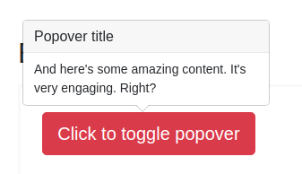

# Домашнее задание к занятию "5. Работа с HTML-формами"

Правила сдачи задания:

1. В рамках этого ДЗ можно использовать любой менеджер пакетов.
2. Всё должно собираться через Webpack (включая картинки и стили) и выкладываться на Github Pages через Appveyor.
3. В README.md должен быть размещён бейджик сборки.
4. Должны быть написаны авто-тесты на взаимодействие с DOM на базе Puppeteer или JSDOM (на выбор).

---

### Popovers

#### Легенда

Есть замечательный фреймворк Bootstrap, в котором реализовано достаточно много интересных виджетов с использованием jQuery. Но, как говорят современные и модные программисты, "jQuery не нужен", поэтому вам нужно реализовать такой же виджет на чистом JS.

#### Описание

Вот так должен выглядеть виджет в целом:

Для упрощения будем считать, что виджет всегда должен показываться сверху.

У popover'а обязательно должно быть название и текст. Центрироваться он обязательно должен по горизонтали относительно элемента, который вызвал появление popover'а.
